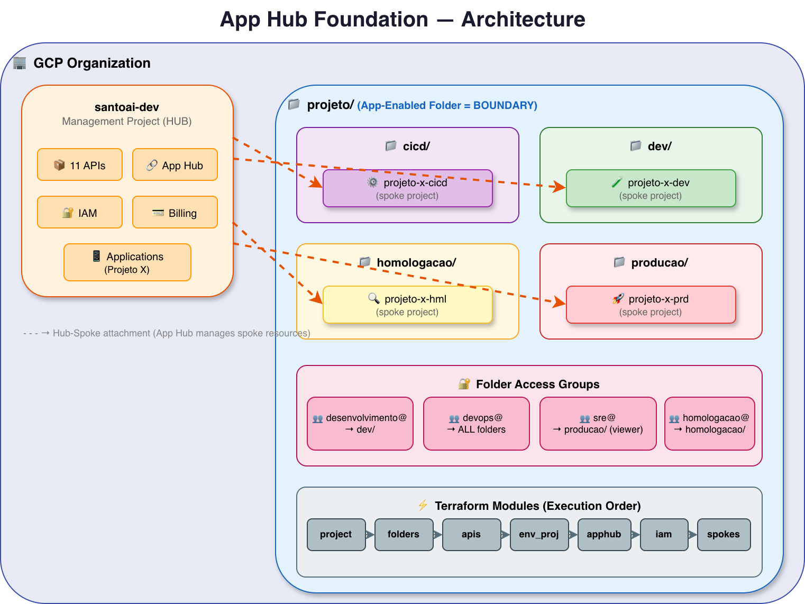
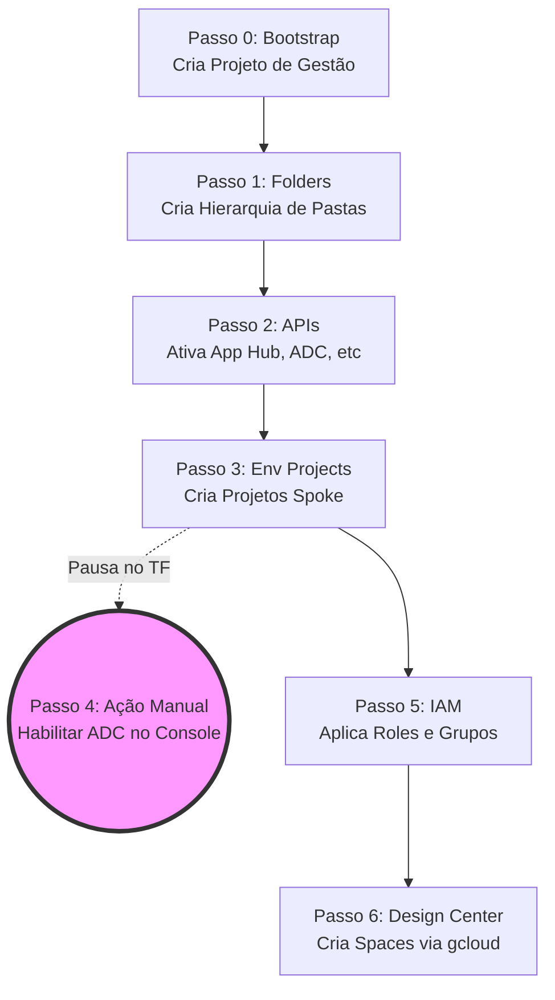

# Tutorial: Google Cloud Foundations com App Hub e Application Design Center (ADC)

Este tutorial vai te guiar pela arquitetura, conceitos e pelo passo a passo de como o código Terraform deste repositório provisiona uma fundação completa no Google Cloud Platform (GCP).

## 1. A Arquitetura do Projeto

Para entendermos o que estamos construindo, dê uma olhada no desenho arquitetural desta fundação.


*(Você também pode visualizar as versões em [Draw.io](foundations/docs/architecture.drawio) ou [SVG](foundations/docs/architecture.svg) na pasta `foundations/docs/` do repositório).*

Quando organizações crescem no GCP, elas precisam de uma forma padronizada de gerenciar projetos, permissões e, o mais importante: **Aplicações**. 

O **App Hub** é o serviço do Google Cloud que descobre e organiza os recursos do GCP (como instâncias, bancos de dados, load balancers) em "Aplicações" lógicas. O **Application Design Center (ADC)** é a evolução visual e arquitetural dessa gestão, permitindo desenhar e governar a topologia das aplicações.

Para que tudo isso funcione, precisamos de uma **Fundação (Foundations)** sólida. Este código Terraform cria a estrutura "hub-and-spoke" (centro e raios), hierarquia de pastas, permissões (IAM) e ativa os serviços necessários para que o ADC brilhe.

---

## 2. Conceitos Fundamentais

Antes de rodar o código, é vital entender a diferença entre como o App Hub funcionava antes e como ele funciona agora (que é o modelo usado aqui).

### Management Project vs. Host Project (A Grande Diferença)

- **Host Project (Legado):** No modelo antigo do App Hub, você criava um "Host Project" e precisava ir em cada projeto da sua organização ("Service Projects") e "anexá-los" (fazer um *attachment*) ao Host Project. Era um trabalho muito manual.
- **Management Project com ADC (Moderno e Usado Aqui):** O Google Cloud evoluiu isso. Agora, você define um **Management Project**. Ao invés de atrelar projetos um a um, o ADC permite definir um **Boundary (Fronteira) em nível de Folder (Pasta)**. 
  - *O que isso significa?* Significa que se você habilitar o ADC apontando para uma pasta (ex: `📁 projeto`), **todos** os projetos que estiverem dentro dessa pasta (e subpastas) serão descobertos e gerenciados automaticamente pelo App Hub. Sem necessidade de atrelar manualmente!

> ⚠️ **Atenção:** É por isso que no arquivo `main.tf`, os módulos `apphub` e `service_projects` estão **comentados**. O Terraform não cria os *attachments*, pois habilitaremos o ADC manualmente no Console para que ele faça o gerenciamento via *Folder Boundary*. Eles são mutuamente exclusivos!

---

## 3. Entendendo as Variáveis (`variables.tf`)

Para adaptar a fundação para a sua empresa, você precisa preencher o arquivo `terraform.tfvars`. Vamos entender as principais variáveis:

### Variáveis Globais
* `org_id`: O ID numérico da sua organização no Google Cloud. (Ex: `"110137831008"`).
* `billing_account`: A conta de faturamento que vai pagar por todos os projetos. Deve estar no formato `XXXXXX-XXXXXX-XXXXXX`.
* `project_id`: O ID do projeto de gestão (Management Project). Onde o App Hub e o ADC vão morar. (Ex: `"exemplosantodigital-appmgmt"`).
* `root_folder_name`: O nome da pasta principal ("Boundary") que o ADC vai monitorar. (Ex: `"exemplosantodigital"`).

### Variáveis de Arquitetura (O Coração da Fundação)
* `environments`: Um mapa (Dicionário) definindo as subpastas (ambientes).
  ```hcl
  environments = {
    "dev" = "Desenvolvimento"
    "prd" = "Producao"
  }
  ```
* `env_projects`: Onde os projetos reais (os *Spokes*) são definidos e alocados em suas respectivas pastas.
  ```hcl
  env_projects = {
    "meu-projeto-backend-dev" = {
      project_id    = "meu-projeto-backend-dev-123"
      display_name  = "Backend API Dev"
      folder_key    = "dev" # Diz que vai pra pasta "Desenvolvimento" criada acima
    }
  }
  ```

### Variáveis de Segurança (IAM)
* `folder_access_groups`: Define quem tem acesso a quais pastas. Segue o princípio do menor privilégio (Least Privilege).
  ```hcl
  folder_access_groups = {
    "time-dev" = {
      member  = "group:devs@minhaempresa.com"
      role    = "roles/viewer"
      folders = ["dev", "hml"] # Só enxergam as pastas Dev e Homologação!
    }
  }
  ```

---

## 4. O Passo a Passo da Execução (O que o Terraform faz)

Para ficar mais claro visualmente, veja como o fluxo de execução do nosso Terraform funciona na prática. A execução (`terraform apply`) orquestra os passos de forma modular para manter a "casa arrumada":



### Passo 0: Bootstrap (`module.project`)
Cria o projeto "Management" (`project_id`), atrela ao `billing_account` e serve como a base de operações.

### Passo 1: Hierarquia de Pastas (`module.folders`)
Cria a pasta raiz (o Boundary) e as subpastas (ambientes) com base na variável `environments`.
* *Resultado:* `📁 raiz / 📁 dev, 📁 prd`.

### Passo 2: Ativação de APIs (`module.apis`)
Ativa as 11+ APIs necessárias no Management Project. Isso inclui `apphub.googleapis.com`, `designcenter.googleapis.com`, `monitoring`, etc. Sem isso, nada funciona.

### Passo 3: Projetos Spoke (`module.env_projects`)
Lê a variável `env_projects`, cria os projetos de fato, os coloca nas pastas corretas e já habilita a API do App Hub dentro deles para que possam ser "descobertos" pelo Management Project.

### Passo 4: O "Enable" Manual do ADC (Sua Vez!)
*O Terraform pausa o fluxo do App Hub aqui.*
Como a API do Google Cloud não suporta a criação do Management Project/Boundary via Terraform, você deve:
1. Abrir o Console do GCP.
2. Ir para o projeto de gestão (`exemplosantodigital-appmgmt`).
3. Buscar por "App Management" e clicar em **Enable**.
4. Ele vai configurar o Boundary automaticamente usando a pasta raiz criada no Passo 1.

### Passo 5: Configuração de IAM (`module.iam`)
Garante que as pessoas certas tenham acesso. 
- Dá `roles/apphub.admin` para os administradores.
- Dá `roles/designcenter.admin` para arquitetos.
- Aplica as permissões da variável `folder_access_groups` diretamente nas pastas.

### Passo 6: Spaces do Design Center (`module.design_center`)
No ADC, os "Spaces" organizam as arquiteturas (ex: "time-plataforma", "time-pagamentos"). O Terraform cria esses Spaces usando a CLI local (`gcloud`), já que o provider do Terraform ainda não suporta essa funcionalidade de forma nativa.

---

## 5. Resumo da Ópera

1. Você preenche o `terraform.tfvars`.
2. Garante que está autenticado com o **Application Default Credentials** (`gcloud auth application-default login`). **Não use `gcloud auth login` apenas!**
3. Roda `terraform apply`.
4. Vai no console e clica em **Enable** no App Management.
5. Pronto! Você tem uma organização GCP nível enterprise, pronta para usar o Application Design Center com segurança, hierarquia e governança.